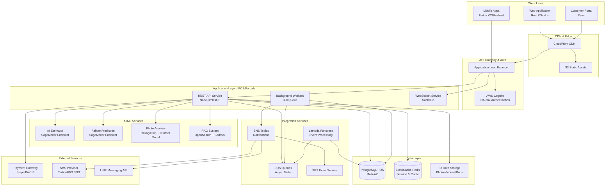
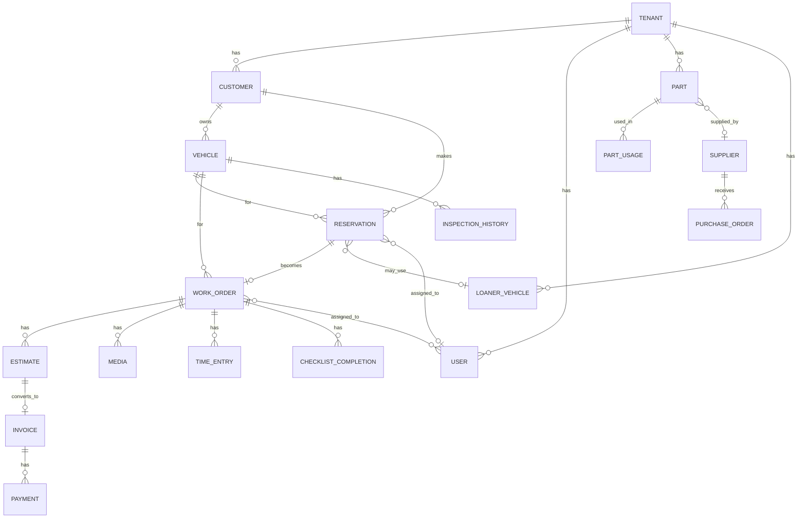

# Design Document: Garage OS

## Overview

Garage OS is a comprehensive multi-tenant SaaS platform designed for automotive repair shops in Japan. The system integrates customer management, vehicle tracking, reservation scheduling, work order management, parts inventory, billing, and AI-powered diagnostic features into a unified platform.

### System Scope

The platform serves repair shops ranging from 3-50 employees, including:
- Street repair shops (街の整備工場)
- Vehicle inspection facilities (車検工場)
- Body shops (板金工場)
- Used car dealerships with repair facilities
- EV repair specialists

### Key Capabilities

1. **Customer & Vehicle Management**: Centralized customer records with vehicle associations, inspection history, and automated reminders
2. **Reservation & Scheduling**: Web-based booking system with calendar management, mechanic assignment, and loaner vehicle coordination
3. **Work Order Management**: Complete workflow from estimate creation through completion, with photo/video documentation and real-time status updates
4. **AI-Powered Features**:
   - Automated estimate generation from symptoms and error codes
   - Failure prediction and diagnostic suggestions
   - Photo analysis for damage detection
   - RAG-based knowledge search across service manuals
5. **Parts & Inventory**: Real-time inventory tracking with automated reorder alerts and supplier management
6. **Billing & Payments**: Estimate-to-invoice conversion with integrated payment processing (credit cards, QR payments, installments)
7. **Business Intelligence**: KPI dashboards with revenue tracking, mechanic utilization, and customer retention metrics
8. **Multi-Platform Access**: Responsive web interface, native mobile apps (iOS/Android), and customer portal
9. **Multi-Tenant Architecture**: Complete data isolation with per-tenant branding and configuration

### Design Principles

1. **Offline-First Mobile**: Mechanics can work without connectivity; changes sync when online
2. **AI-Augmented Workflow**: AI assists but doesn't replace human judgment; all AI outputs are editable
3. **Progressive Disclosure**: Complex features available but not overwhelming for basic users
4. **Tenant Isolation**: Absolute data separation between garages with no cross-tenant data leakage
5. **Cost Optimization**: Intelligent storage tiering and resource scaling to maintain profitability
6. **Localization-First**: Japanese as primary language with cultural considerations (QR payments, business practices)

## Architecture

### High-Level Architecture




### Architecture Layers

#### 1. Client Layer
- **Web Application**: React/Next.js SPA with server-side rendering for SEO and initial load performance
- **Mobile Applications**: Flutter-based native apps for iOS and Android with offline-first architecture
- **Customer Portal**: Simplified React application for customer self-service

#### 2. CDN & Edge Layer
- **CloudFront**: Global CDN for static assets and API response caching
- **S3 Static Hosting**: Hosts web application bundles and static resources

#### 3. API Gateway & Authentication
- **Application Load Balancer**: Routes traffic to appropriate services with health checks
- **AWS Cognito**: Manages user authentication, OAuth2 flows, and JWT token issuance
- **Multi-tenant routing**: Tenant identification via subdomain or JWT claims

#### 4. Application Layer (ECS Fargate)
- **REST API Service**: NestJS-based API handling all business logic
  - Auto-scaling based on CPU/memory metrics
  - Horizontal scaling across multiple availability zones
  - Stateless design for easy scaling
- **Background Workers**: Bull queue processors for async tasks
  - Email/SMS sending
  - Report generation
  - Data aggregation for KPIs
  - AI model inference batching
- **WebSocket Service**: Real-time updates for work status changes and notifications

#### 5. AI/ML Services
- **AI Estimator**: SageMaker-hosted model for repair cost estimation
  - Input: Vehicle specs, symptoms, error codes, historical data
  - Output: Repair candidates with confidence scores, labor hours, parts list
- **Failure Prediction**: SageMaker-hosted classification model
  - Input: Symptoms, error codes, vehicle history
  - Output: Ranked failure candidates with diagnostic steps
- **Photo Analysis**: Combination of AWS Rekognition and custom SageMaker model
  - Rekognition for general object detection
  - Custom model for automotive-specific damage detection
- **RAG System**: OpenSearch vector database + AWS Bedrock
  - Indexes service manuals, technical bulletins, past repair records
  - Semantic search with context-aware responses

#### 6. Data Layer
- **PostgreSQL RDS**: Primary relational database
  - Multi-AZ deployment for high availability
  - Read replicas for reporting queries
  - Row-level security for multi-tenant isolation
- **ElastiCache Redis**: Session storage and application cache
  - Reduces database load for frequently accessed data
  - Stores real-time work status updates
- **S3 Data Storage**: Object storage for media and documents
  - Lifecycle policies: Standard → Infrequent Access (90 days) → Glacier (1 year)
  - Versioning enabled for critical documents

#### 7. Integration Services
- **Lambda Functions**: Event-driven processing
  - S3 event triggers for image compression
  - Scheduled tasks for reminder generation
  - Database triggers for audit logging
- **SQS Queues**: Decouples services and ensures reliable message delivery
- **SNS Topics**: Fan-out notifications to multiple channels
- **SES**: Transactional email delivery

#### 8. External Services
- **Payment Gateway**: Stripe or PAY.JP for Japanese market
  - Credit card processing
  - QR payment generation (PayPay, LINE Pay)
  - Installment payment support
- **SMS Provider**: Twilio or AWS SNS for SMS notifications
- **LINE Messaging API**: Direct integration for LINE notifications

### Multi-Tenant Architecture


#### Tenant Isolation Strategy

**Database-Level Isolation** (Chosen Approach):
- Single PostgreSQL database with `tenant_id` column on all tables
- Row-Level Security (RLS) policies enforce tenant boundaries
- Application sets `app.current_tenant` session variable on each request
- Prevents accidental cross-tenant queries at database level

**Rationale**: Database-per-tenant is too expensive at scale; schema-per-tenant complicates migrations. RLS provides strong isolation with operational simplicity.

**Tenant Identification**:
- Subdomain-based: `{tenant-slug}.garage-os.com`
- JWT claims include `tenant_id` after authentication
- API middleware validates tenant access on every request

**Resource Isolation**:
- S3 bucket structure: `s3://garage-os-data/{tenant_id}/{resource_type}/`
- CloudWatch log groups per tenant for debugging
- Usage metrics tracked per tenant for billing

### Scalability & Performance

**Horizontal Scaling**:
- API services: Auto-scale based on CPU (target 70%) and request count
- Worker services: Scale based on SQS queue depth
- Database: Read replicas for reporting queries; connection pooling (PgBouncer)

**Caching Strategy**:
- Redis cache for:
  - User sessions (TTL: 24 hours)
  - Frequently accessed reference data (vehicle makes/models, part catalogs)
  - KPI dashboard data (TTL: 5 minutes)
- CloudFront cache for static assets (TTL: 1 year with versioned URLs)

**Database Optimization**:
- Indexes on: `tenant_id`, foreign keys, frequently queried fields
- Partitioning for large tables (work_orders, inspection_history) by date
- Materialized views for complex KPI calculations, refreshed hourly

## Components and Interfaces

### Core Domain Components

#### 1. Customer Management Service

**Responsibilities**:
- CRUD operations for customers and vehicles
- Search functionality (name, phone, registration number)
- Vehicle-customer association management

**Key Interfaces**:
```typescript
interface CustomerService {
  createCustomer(data: CreateCustomerDTO): Promise<Customer>;
  updateCustomer(id: string, data: UpdateCustomerDTO): Promise<Customer>;
  searchCustomers(query: SearchQuery): Promise<Customer[]>;
  getCustomerWithVehicles(id: string): Promise<CustomerWithVehicles>;
  deleteCustomer(id: string): Promise<void>;
}

interface VehicleService {
  createVehicle(customerId: string, data: CreateVehicleDTO): Promise<Vehicle>;
  updateVehicle(id: string, data: UpdateVehicleDTO): Promise<Vehicle>;
  getVehicleHistory(id: string): Promise<InspectionHistory[]>;
  updateMileage(id: string, mileage: number): Promise<Vehicle>;
}
```

**Database Tables**:
- `customers`: id, tenant_id, name, phone, email, address, created_at, updated_at
- `vehicles`: id, tenant_id, customer_id, make, model, year, registration_number, vin, mileage, inspection_expiry, insurance_expiry

#### 2. Reservation Management Service

**Responsibilities**:
- Web booking availability calculation
- Reservation CRUD with conflict detection
- Calendar view generation
- Loaner vehicle assignment

**Key Interfaces**:
```typescript
interface ReservationService {
  getAvailableSlots(date: Date, serviceType: string): Promise<TimeSlot[]>;
  createReservation(data: CreateReservationDTO): Promise<Reservation>;
  updateReservation(id: string, data: UpdateReservationDTO): Promise<Reservation>;
  assignMechanic(reservationId: string, mechanicId: string): Promise<void>;
  getCalendarView(startDate: Date, endDate: Date): Promise<CalendarEvent[]>;
}

interface LoanerVehicleService {
  checkAvailability(startDate: Date, endDate: Date): Promise<LoanerVehicle[]>;
  assignLoaner(reservationId: string, loanerId: string): Promise<void>;
  returnLoaner(loanerId: string): Promise<void>;
  getLoanerStatus(): Promise<LoanerVehicleStatus[]>;
}
```

**Database Tables**:
- `reservations`: id, tenant_id, customer_id, vehicle_id, scheduled_date, service_type, status, assigned_mechanic_id, loaner_vehicle_id
- `loaner_vehicles`: id, tenant_id, registration_number, make, model, status (available, reserved, in_use, maintenance)
- `loaner_assignments`: id, tenant_id, loaner_vehicle_id, reservation_id, start_date, end_date, returned_at


#### 3. Work Order Management Service

**Responsibilities**:
- Work order lifecycle management (creation → completion)
- Status tracking with history
- Photo/video attachment handling
- Checklist management
- Time tracking

**Key Interfaces**:
```typescript
interface WorkOrderService {
  createWorkOrder(reservationId: string): Promise<WorkOrder>;
  updateStatus(id: string, status: WorkStatus, mechanicId: string): Promise<WorkOrder>;
  getWorkOrder(id: string): Promise<WorkOrderDetail>;
  assignMechanics(id: string, mechanicIds: string[]): Promise<void>;
  getActiveWorkOrders(): Promise<WorkOrder[]>;
}

interface MediaService {
  uploadPhoto(workOrderId: string, file: File, caption?: string): Promise<Media>;
  uploadVideo(workOrderId: string, file: File, caption?: string): Promise<Media>;
  getWorkOrderMedia(workOrderId: string): Promise<Media[]>;
  shareMediaWithCustomer(mediaIds: string[]): Promise<void>;
}

interface ChecklistService {
  getChecklistForServiceType(serviceType: string): Promise<Checklist>;
  markItemComplete(workOrderId: string, itemId: string, mechanicId: string): Promise<void>;
  getChecklistProgress(workOrderId: string): Promise<ChecklistProgress>;
}

interface TimeTrackingService {
  startTimer(workOrderId: string, mechanicId: string): Promise<TimeEntry>;
  pauseTimer(entryId: string): Promise<TimeEntry>;
  resumeTimer(entryId: string): Promise<TimeEntry>;
  stopTimer(entryId: string): Promise<TimeEntry>;
  getTotalTime(workOrderId: string): Promise<number>;
}
```

**Database Tables**:
- `work_orders`: id, tenant_id, reservation_id, vehicle_id, status, created_at, completed_at
- `work_order_assignments`: id, work_order_id, mechanic_id, assigned_at
- `work_status_history`: id, work_order_id, status, mechanic_id, timestamp
- `media`: id, tenant_id, work_order_id, type (photo/video), s3_key, caption, uploaded_by, uploaded_at
- `checklists`: id, tenant_id, service_type, items (JSONB)
- `checklist_completions`: id, work_order_id, item_id, mechanic_id, completed_at
- `time_entries`: id, work_order_id, mechanic_id, start_time, end_time, paused_duration

#### 4. Estimation & Billing Service

**Responsibilities**:
- Estimate creation and management
- AI-powered estimate generation
- Estimate-to-invoice conversion
- Payment processing integration

**Key Interfaces**:
```typescript
interface EstimateService {
  createEstimate(workOrderId: string, items: EstimateItem[]): Promise<Estimate>;
  updateEstimate(id: string, items: EstimateItem[]): Promise<Estimate>;
  applyDiscount(id: string, discount: Discount): Promise<Estimate>;
  sendToCustomer(id: string, method: 'email' | 'print'): Promise<void>;
  getEstimateHistory(workOrderId: string): Promise<Estimate[]>;
}

interface AIEstimatorService {
  generateEstimate(input: EstimateInput): Promise<AIEstimateResult>;
  // EstimateInput: { vehicleId, symptoms, errorCodes, mileage }
  // AIEstimateResult: { candidates: RepairCandidate[], confidence: number }
}

interface InvoiceService {
  convertEstimateToInvoice(estimateId: string): Promise<Invoice>;
  addCharges(invoiceId: string, charges: InvoiceItem[]): Promise<Invoice>;
  sendToCustomer(id: string, method: 'email' | 'print'): Promise<void>;
  recordPayment(invoiceId: string, payment: PaymentRecord): Promise<Invoice>;
}

interface PaymentService {
  processCardPayment(invoiceId: string, cardToken: string): Promise<PaymentResult>;
  generateQRPayment(invoiceId: string, method: 'paypay' | 'linepay'): Promise<QRCode>;
  createInstallmentPlan(invoiceId: string, plan: InstallmentPlan): Promise<PaymentSchedule>;
  getPaymentStatus(invoiceId: string): Promise<PaymentStatus>;
}
```

**Database Tables**:
- `estimates`: id, tenant_id, work_order_id, version, items (JSONB), subtotal, tax, discount, total, status, created_at
- `invoices`: id, tenant_id, work_order_id, estimate_id, invoice_number, items (JSONB), subtotal, tax, total, status, issued_at
- `payments`: id, tenant_id, invoice_id, amount, method, transaction_id, status, processed_at
- `installment_schedules`: id, invoice_id, total_amount, installments (JSONB), status


#### 5. Parts & Inventory Service

**Responsibilities**:
- Inventory tracking and management
- Parts search and lookup
- Reorder alert generation
- Purchase order management

**Key Interfaces**:
```typescript
interface InventoryService {
  searchParts(query: PartSearchQuery): Promise<Part[]>;
  getPart(id: string): Promise<PartDetail>;
  updateQuantity(partId: string, quantity: number, reason: string): Promise<Part>;
  consumeParts(workOrderId: string, parts: PartConsumption[]): Promise<void>;
  getReorderAlerts(): Promise<ReorderAlert[]>;
  getUsageHistory(partId: string): Promise<PartUsage[]>;
}

interface PurchaseOrderService {
  createPurchaseOrder(supplierId: string, items: POItem[]): Promise<PurchaseOrder>;
  sendToSupplier(poId: string): Promise<void>;
  receiveParts(poId: string, received: ReceivedItem[]): Promise<void>;
  updateInventoryFromPO(poId: string): Promise<void>;
}

interface SupplierService {
  createSupplier(data: CreateSupplierDTO): Promise<Supplier>;
  updateSupplier(id: string, data: UpdateSupplierDTO): Promise<Supplier>;
  getSuppliers(): Promise<Supplier[]>;
}
```

**Database Tables**:
- `parts`: id, tenant_id, part_number, name, description, quantity, min_quantity, unit_cost, supplier_id
- `part_usage`: id, tenant_id, part_id, work_order_id, quantity, used_at
- `suppliers`: id, tenant_id, name, contact_name, email, phone, address
- `purchase_orders`: id, tenant_id, supplier_id, po_number, items (JSONB), total, status, created_at, expected_delivery
- `po_receipts`: id, purchase_order_id, received_items (JSONB), received_at

#### 6. AI Services

**Responsibilities**:
- AI estimate generation
- Failure prediction
- Photo analysis for damage detection
- Knowledge search (RAG)

**Key Interfaces**:
```typescript
interface AIEstimatorService {
  generateEstimate(input: {
    vehicleId: string;
    symptoms: string[];
    errorCodes: string[];
    mileage: number;
  }): Promise<{
    candidates: Array<{
      issue: string;
      laborHours: number;
      parts: Array<{ partId: string; quantity: number }>;
      estimatedCost: number;
      confidence: number;
    }>;
  }>;
}

interface FailurePredictionService {
  predictFailures(input: {
    vehicleId: string;
    symptoms: string[];
    errorCodes: string[];
  }): Promise<{
    failures: Array<{
      component: string;
      probability: number;
      explanation: string;
      diagnosticSteps: string[];
    }>;
  }>;
  recordConfirmedDiagnosis(workOrderId: string, actualFailure: string): Promise<void>;
}

interface PhotoAnalysisService {
  analyzePhoto(photoId: string): Promise<{
    detectedIssues: Array<{
      type: 'scratch' | 'dent' | 'crack' | 'wear';
      location: BoundingBox;
      severity: 'low' | 'medium' | 'high';
      confidence: number;
    }>;
    measurements?: {
      brakeThickness?: number;
      treadDepth?: number;
    };
  }>;
}

interface RAGKnowledgeService {
  search(query: string, filters?: {
    vehicleMake?: string;
    vehicleModel?: string;
  }): Promise<{
    results: Array<{
      source: 'manual' | 'bulletin' | 'past_case';
      title: string;
      excerpt: string;
      relevanceScore: number;
      documentId: string;
    }>;
  }>;
  indexDocument(document: {
    type: 'manual' | 'bulletin';
    content: string;
    metadata: Record<string, any>;
  }): Promise<void>;
}
```

**AI Model Details**:

**AI Estimator Model**:
- Architecture: Gradient Boosting (XGBoost) or Neural Network
- Training data: Historical work orders with actual labor hours and parts used
- Features: Vehicle make/model/year, mileage, symptom embeddings, error code embeddings, seasonal factors
- Output: Top 5 repair candidates with confidence scores
- Retraining: Monthly with new confirmed diagnoses

**Failure Prediction Model**:
- Architecture: Multi-label classification (Random Forest or Transformer)
- Training data: Symptom descriptions + error codes → confirmed failures
- Features: Symptom text embeddings (BERT), error code one-hot encoding, vehicle metadata
- Output: Ranked list of likely failures with probabilities
- Retraining: Bi-weekly with feedback loop from confirmed diagnoses

**Photo Analysis Model**:
- Architecture: Object detection (YOLO or Faster R-CNN) + custom classification head
- Training data: Annotated images of vehicle damage and wear indicators
- Features: Image pixels, vehicle part context
- Output: Bounding boxes with damage type and severity
- Specialized models for: brake pads, tire tread, body damage
- Retraining: Quarterly with new annotated images

**RAG System**:
- Vector database: OpenSearch with k-NN plugin
- Embedding model: Multilingual BERT (Japanese + English)
- Document corpus: Service manuals (PDF), technical bulletins, past work order notes
- Retrieval: Semantic search with re-ranking
- Generation: AWS Bedrock (Claude or GPT-4) for answer synthesis
- Update frequency: Real-time for new work orders, batch for manuals


#### 7. Notification Service

**Responsibilities**:
- Multi-channel notification delivery (email, SMS, LINE, push)
- Reminder generation and scheduling
- User notification preferences management

**Key Interfaces**:
```typescript
interface NotificationService {
  sendNotification(notification: {
    tenantId: string;
    userId: string;
    type: NotificationType;
    channels: Channel[];
    content: NotificationContent;
    priority: 'low' | 'normal' | 'high';
  }): Promise<void>;
  
  scheduleReminder(reminder: {
    tenantId: string;
    vehicleId: string;
    type: 'inspection' | 'insurance' | 'maintenance';
    scheduledDate: Date;
  }): Promise<void>;
  
  getUserPreferences(userId: string): Promise<NotificationPreferences>;
  updatePreferences(userId: string, prefs: NotificationPreferences): Promise<void>;
}

interface ReminderService {
  generateInspectionReminders(): Promise<void>; // Runs daily
  generateMaintenanceReminders(): Promise<void>; // Based on mileage
  getUpcomingReminders(tenantId: string): Promise<Reminder[]>;
}
```

**Implementation**:
- SQS queue for notification delivery (decouples from main API)
- Lambda function processes queue and calls appropriate provider (SES, SNS, LINE API)
- DynamoDB table for notification history and delivery status
- EventBridge scheduled rule triggers daily reminder generation

**Database Tables**:
- `notification_preferences`: id, user_id, email_enabled, sms_enabled, push_enabled, line_enabled, quiet_hours_start, quiet_hours_end, categories (JSONB)
- `notification_history`: id, tenant_id, user_id, type, channels, content, status, sent_at
- `scheduled_reminders`: id, tenant_id, vehicle_id, type, scheduled_date, sent_at

#### 8. Analytics & Reporting Service

**Responsibilities**:
- KPI calculation and dashboard data
- Report generation (PDF, Excel)
- Historical data aggregation

**Key Interfaces**:
```typescript
interface AnalyticsService {
  getKPIDashboard(tenantId: string, dateRange: DateRange): Promise<{
    revenue: number;
    profitMargin: number;
    mechanicUtilization: Record<string, number>;
    customerReturnRate: number;
    averageInvoiceAmount: number;
    inspectionRenewalRate: number;
  }>;
  
  getMechanicPerformance(mechanicId: string, dateRange: DateRange): Promise<{
    completedJobs: number;
    totalRevenue: number;
    averageJobTime: number;
    customerSatisfaction: number;
  }>;
  
  getRevenueByServiceType(tenantId: string, dateRange: DateRange): Promise<Record<string, number>>;
}

interface ReportService {
  generateReport(config: {
    tenantId: string;
    type: 'revenue' | 'customer_acquisition' | 'mechanic_performance' | 'service_types';
    dateRange: DateRange;
    format: 'pdf' | 'excel';
  }): Promise<string>; // Returns S3 URL
  
  scheduleReport(config: ReportConfig & { schedule: CronExpression }): Promise<void>;
}
```

**Implementation**:
- Materialized views in PostgreSQL for complex aggregations (refreshed hourly)
- Redis cache for dashboard data (5-minute TTL)
- Lambda function for report generation (uses Puppeteer for PDF, ExcelJS for Excel)
- S3 storage for generated reports with signed URLs

**Materialized Views**:
- `mv_daily_revenue`: Aggregates revenue by tenant and date
- `mv_mechanic_utilization`: Calculates worked hours vs available hours
- `mv_customer_retention`: Tracks repeat customers by cohort

#### 9. User Management & Access Control

**Responsibilities**:
- User authentication and authorization
- Role-based access control (RBAC)
- Tenant user management

**Key Interfaces**:
```typescript
interface UserService {
  createUser(tenantId: string, data: CreateUserDTO): Promise<User>;
  updateUser(userId: string, data: UpdateUserDTO): Promise<User>;
  assignRole(userId: string, role: Role): Promise<void>;
  deactivateUser(userId: string): Promise<void>;
  getUsersByTenant(tenantId: string): Promise<User[]>;
}

interface AuthService {
  login(email: string, password: string): Promise<AuthTokens>;
  refreshToken(refreshToken: string): Promise<AuthTokens>;
  logout(userId: string): Promise<void>;
  resetPassword(email: string): Promise<void>;
  changePassword(userId: string, oldPassword: string, newPassword: string): Promise<void>;
}

interface PermissionService {
  checkPermission(userId: string, resource: string, action: string): Promise<boolean>;
  getRolePermissions(role: Role): Promise<Permission[]>;
}
```

**Roles & Permissions**:

| Role | Permissions |
|------|-------------|
| Administrator | All permissions, tenant configuration, user management |
| Manager | View all data, KPI dashboard, reports, cannot modify operational data |
| Service Advisor | Customer/vehicle CRUD, reservations, estimates, invoices, work order viewing |
| Mechanic | Work order updates, time tracking, photo upload, checklist completion, parts lookup |

**Database Tables**:
- `users`: id, tenant_id, email, password_hash, role, name, phone, active, created_at
- `roles`: id, name, permissions (JSONB)
- `audit_log`: id, tenant_id, user_id, action, resource_type, resource_id, timestamp, ip_address


#### 10. Mobile Application Architecture

**Offline-First Design**:
- Local SQLite database for data persistence
- Sync engine with conflict resolution
- Queue for pending operations when offline

**Key Components**:

```typescript
// Mobile App Architecture
interface MobileDataService {
  // Local database operations
  getLocalWorkOrders(): Promise<WorkOrder[]>;
  saveWorkOrderLocally(workOrder: WorkOrder): Promise<void>;
  
  // Sync operations
  syncWithServer(): Promise<SyncResult>;
  queueOperation(operation: PendingOperation): Promise<void>;
  processPendingQueue(): Promise<void>;
}

interface ConflictResolver {
  resolveConflict(local: Entity, remote: Entity): Promise<Entity>;
  // Strategy: Last-write-wins with timestamp comparison
  // Exception: Photo uploads always merge (never conflict)
}
```

**Sync Strategy**:
1. **Pull-first sync**: Download server changes before pushing local changes
2. **Incremental sync**: Only sync changed records since last sync (using `updated_at` timestamp)
3. **Conflict resolution**: Server timestamp wins for most fields; photos/videos always merge
4. **Sync triggers**: 
   - App foreground (automatic)
   - Manual refresh button
   - After completing offline operations
   - Periodic background sync (every 15 minutes when online)

**Mobile Features**:
- View assigned work orders
- Update work status
- Upload photos/videos (queued when offline)
- Start/stop time tracking
- Complete checklist items
- Search parts inventory
- Barcode scanning for part lookup
- Voice input for notes

**Technology Stack**:
- Flutter for cross-platform development
- SQLite (via sqflite package) for local storage
- Dio for HTTP client with retry logic
- Riverpod for state management
- Camera plugin for photo/video capture
- Barcode scanner plugin
- Speech-to-text plugin for voice input

#### 11. Customer Portal

**Responsibilities**:
- Customer self-service for viewing data
- Reservation management
- Invoice viewing and payment

**Key Features**:
- View owned vehicles and service history
- View upcoming reservations
- View and download invoices
- Update contact information
- Receive notifications for work status updates

**Technology Stack**:
- React SPA with TypeScript
- Tailwind CSS for styling
- React Query for data fetching
- Separate authentication from main app (customer-specific Cognito user pool)

#### 12. Voice Input Service

**Responsibilities**:
- Speech-to-text conversion
- Automotive terminology recognition
- Noise filtering for workshop environment

**Implementation**:
- AWS Transcribe for speech-to-text
- Custom vocabulary for automotive terms (Japanese and English)
- Noise reduction preprocessing
- Confidence scoring for transcription quality
- Manual review/edit interface for low-confidence transcriptions

**Key Interfaces**:
```typescript
interface VoiceInputService {
  transcribe(audioFile: File): Promise<{
    text: string;
    confidence: number;
    alternatives?: string[];
  }>;
  
  addCustomVocabulary(terms: string[]): Promise<void>;
}
```

## Data Models

### Core Entities

#### Customer
```typescript
interface Customer {
  id: string;
  tenantId: string;
  name: string;
  phone: string;
  email?: string;
  address?: string;
  createdAt: Date;
  updatedAt: Date;
}
```

#### Vehicle
```typescript
interface Vehicle {
  id: string;
  tenantId: string;
  customerId: string;
  make: string;
  model: string;
  year: number;
  registrationNumber: string;
  vin: string;
  mileage: number;
  inspectionExpiry: Date;
  insuranceExpiry?: Date;
  createdAt: Date;
  updatedAt: Date;
}
```

#### Reservation
```typescript
interface Reservation {
  id: string;
  tenantId: string;
  customerId: string;
  vehicleId: string;
  scheduledDate: Date;
  serviceType: string;
  status: 'pending' | 'confirmed' | 'in_progress' | 'completed' | 'cancelled';
  assignedMechanicId?: string;
  loanerVehicleId?: string;
  notes?: string;
  createdAt: Date;
  updatedAt: Date;
}
```

#### WorkOrder
```typescript
interface WorkOrder {
  id: string;
  tenantId: string;
  reservationId: string;
  vehicleId: string;
  status: 'scheduled' | 'checked_in' | 'in_progress' | 'completed' | 'delivered';
  assignedMechanics: string[]; // Array of mechanic IDs
  createdAt: Date;
  completedAt?: Date;
  updatedAt: Date;
}
```

#### Estimate
```typescript
interface Estimate {
  id: string;
  tenantId: string;
  workOrderId: string;
  version: number;
  items: EstimateItem[];
  subtotal: number;
  tax: number;
  discount: number;
  total: number;
  status: 'draft' | 'sent' | 'approved' | 'rejected';
  createdAt: Date;
  sentAt?: Date;
}

interface EstimateItem {
  type: 'labor' | 'part' | 'other';
  description: string;
  quantity: number;
  unitPrice: number;
  total: number;
  partId?: string;
}
```

#### Invoice
```typescript
interface Invoice {
  id: string;
  tenantId: string;
  workOrderId: string;
  estimateId: string;
  invoiceNumber: string;
  items: InvoiceItem[];
  subtotal: number;
  tax: number;
  total: number;
  paidAmount: number;
  status: 'unpaid' | 'partial' | 'paid';
  issuedAt: Date;
  paidAt?: Date;
}

interface InvoiceItem {
  type: 'labor' | 'part' | 'other';
  description: string;
  quantity: number;
  unitPrice: number;
  total: number;
}
```


#### Part
```typescript
interface Part {
  id: string;
  tenantId: string;
  partNumber: string;
  name: string;
  description?: string;
  quantity: number;
  minQuantity: number;
  unitCost: number;
  supplierId?: string;
  vehicleCompatibility?: string[]; // Array of make/model patterns
  createdAt: Date;
  updatedAt: Date;
}
```

#### Media
```typescript
interface Media {
  id: string;
  tenantId: string;
  workOrderId: string;
  type: 'photo' | 'video';
  s3Key: string;
  thumbnailS3Key?: string;
  caption?: string;
  uploadedBy: string;
  uploadedAt: Date;
  sharedWithCustomer: boolean;
  analysisResult?: PhotoAnalysisResult;
}

interface PhotoAnalysisResult {
  detectedIssues: Array<{
    type: string;
    location: { x: number; y: number; width: number; height: number };
    severity: string;
    confidence: number;
  }>;
  measurements?: Record<string, number>;
}
```

#### TimeEntry
```typescript
interface TimeEntry {
  id: string;
  workOrderId: string;
  mechanicId: string;
  startTime: Date;
  endTime?: Date;
  pausedDuration: number; // seconds
  totalDuration?: number; // seconds, calculated when ended
}
```

#### Tenant
```typescript
interface Tenant {
  id: string;
  slug: string; // For subdomain
  name: string;
  logo?: string;
  primaryColor?: string;
  businessHours: BusinessHours;
  serviceTypes: string[];
  subscriptionPlan: 'small' | 'standard' | 'enterprise';
  subscriptionStatus: 'active' | 'suspended' | 'cancelled';
  features: TenantFeatures;
  createdAt: Date;
  updatedAt: Date;
}

interface BusinessHours {
  monday: { open: string; close: string } | null;
  tuesday: { open: string; close: string } | null;
  wednesday: { open: string; close: string } | null;
  thursday: { open: string; close: string } | null;
  friday: { open: string; close: string } | null;
  saturday: { open: string; close: string } | null;
  sunday: { open: string; close: string } | null;
}

interface TenantFeatures {
  aiEstimator: boolean;
  photoAnalysis: boolean;
  voiceInput: boolean;
  lineIntegration: boolean;
  apiAccess: boolean;
  maxUsers: number;
  maxMonthlyAIEstimates: number;
  maxMonthlySMS: number;
}
```

### Database Schema Relationships



### Data Retention & Archival

**Active Data** (PostgreSQL):
- Current and recent work orders (last 2 years)
- Active customers and vehicles
- Current inventory and financial records

**Archived Data** (S3 + Glacier):
- Work orders older than 2 years
- Media files older than 1 year (moved to Glacier)
- Historical reports

**Archival Process**:
- Monthly Lambda function identifies records for archival
- Export to JSON and store in S3
- Delete from PostgreSQL after verification
- Maintain index in PostgreSQL for search (with S3 reference)

## Error Handling

### Error Categories

1. **Client Errors (4xx)**:
   - 400 Bad Request: Invalid input data
   - 401 Unauthorized: Missing or invalid authentication
   - 403 Forbidden: Insufficient permissions or tenant access violation
   - 404 Not Found: Resource doesn't exist
   - 409 Conflict: Reservation double-booking, concurrent updates
   - 422 Unprocessable Entity: Business rule violation

2. **Server Errors (5xx)**:
   - 500 Internal Server Error: Unexpected application error
   - 502 Bad Gateway: Downstream service failure (payment gateway, AI service)
   - 503 Service Unavailable: System maintenance or overload
   - 504 Gateway Timeout: Long-running operation timeout

### Error Response Format

```typescript
interface ErrorResponse {
  error: {
    code: string; // Machine-readable error code
    message: string; // Human-readable message (localized)
    details?: Record<string, any>; // Additional context
    requestId: string; // For support tracking
  };
}
```

### Error Handling Strategies

**Database Errors**:
- Connection pool exhaustion: Retry with exponential backoff (max 3 attempts)
- Deadlock: Automatic retry with jitter
- Constraint violation: Return 409 Conflict with details
- Query timeout: Log slow query, return 504, alert if frequent

**External Service Errors**:
- Payment gateway failure: Return 502, queue for retry, notify user
- AI service timeout: Return cached/default result if available, otherwise 504
- SMS/Email delivery failure: Queue for retry (max 5 attempts over 24 hours)
- S3 upload failure: Retry with exponential backoff (max 5 attempts)

**Tenant Isolation Violations**:
- Attempted cross-tenant access: Log security event, return 403, alert admin
- Missing tenant context: Return 400, log application error

**Concurrency Conflicts**:
- Optimistic locking: Use `version` field, return 409 on conflict
- Reservation double-booking: Database unique constraint + application-level check
- Inventory race condition: Use database transactions with serializable isolation

### Logging & Monitoring

**Structured Logging**:
```typescript
interface LogEntry {
  timestamp: string;
  level: 'debug' | 'info' | 'warn' | 'error';
  tenantId?: string;
  userId?: string;
  requestId: string;
  service: string;
  message: string;
  context?: Record<string, any>;
  error?: {
    name: string;
    message: string;
    stack: string;
  };
}
```

**CloudWatch Metrics**:
- API response times (p50, p95, p99)
- Error rates by endpoint and error type
- Database connection pool utilization
- AI service latency and error rates
- Queue depth for async tasks
- Tenant-specific usage metrics

**Alerts**:
- Error rate > 5% for 5 minutes → Page on-call engineer
- Database CPU > 80% for 10 minutes → Alert DevOps
- Payment gateway errors > 10 in 5 minutes → Alert finance team
- Tenant isolation violation → Immediate security alert
- Backup failure → Alert DevOps


## Testing Strategy

### Testing Approach Overview

**Property-Based Testing is NOT the primary testing strategy for Garage OS** because the system is predominantly composed of:
- **Infrastructure as Code**: AWS resource provisioning and configuration
- **UI Components**: Web and mobile interfaces with user interactions
- **External Service Integrations**: Payment gateways, SMS providers, AI services
- **CRUD Operations**: Database read/write operations with minimal transformation logic
- **Multi-tenant Configuration**: Tenant-specific settings and data isolation

These components are better validated through:
- **Integration Tests**: Verify service interactions and data flow
- **Unit Tests**: Test specific business logic with concrete examples
- **End-to-End Tests**: Validate complete user workflows
- **Infrastructure Tests**: Verify AWS resource configuration
- **Contract Tests**: Ensure API compatibility

### Testing Pyramid

```
        /\
       /  \  E2E Tests (5%)
      /____\  - Critical user journeys
     /      \  - Cross-service workflows
    /________\ Integration Tests (30%)
   /          \ - API endpoints
  /____________\ - Service interactions
 /              \ - Database operations
/________________\ Unit Tests (65%)
                   - Business logic
                   - Validation rules
                   - Calculations
```

### Test Categories

#### 1. Unit Tests

**Scope**: Individual functions and methods with minimal dependencies

**Examples**:
- Estimate calculation logic (subtotal, tax, discount, total)
- Date/time utilities (business hours calculation, reminder scheduling)
- Validation functions (email format, phone number, VIN)
- Permission checking logic
- Data transformation functions

**Tools**: Jest (Node.js), Flutter Test (mobile)

**Coverage Target**: 80% code coverage for business logic

#### 2. Integration Tests

**Scope**: Service interactions, database operations, external APIs

**Examples**:
- API endpoint tests with real database (test database)
- Reservation conflict detection with concurrent requests
- Payment gateway integration (using test mode)
- S3 upload and retrieval
- Email/SMS sending (using mock providers)
- AI service integration (using mock responses)

**Tools**: 
- Supertest for API testing
- Testcontainers for PostgreSQL and Redis
- AWS SDK mocks for S3, SES, SNS

**Coverage Target**: All critical API endpoints and service integrations

#### 3. End-to-End Tests

**Scope**: Complete user workflows across multiple services

**Examples**:
- Customer books appointment → receives confirmation → work completed → invoice paid
- Mechanic updates work status → customer receives notification
- Service advisor creates estimate → converts to invoice → processes payment
- AI estimate generation → manual editing → approval → work order creation

**Tools**: 
- Playwright for web application
- Flutter integration tests for mobile
- Separate test tenant in staging environment

**Coverage Target**: Top 10 critical user journeys

#### 4. Infrastructure Tests

**Scope**: AWS resource configuration and deployment

**Examples**:
- Terraform/CDK configuration validation
- Security group rules verification
- IAM policy correctness
- RDS Multi-AZ configuration
- S3 bucket policies and lifecycle rules
- CloudWatch alarm configuration

**Tools**:
- Terraform validate / CDK synth
- AWS Config Rules
- Custom scripts for policy validation
- Checkov for security scanning

**Coverage Target**: All infrastructure components

#### 5. Performance Tests

**Scope**: System performance under load

**Examples**:
- API response time under normal load (100 req/s)
- Database query performance with large datasets
- Concurrent reservation booking (race conditions)
- Mobile app sync performance with large datasets
- AI service latency

**Tools**:
- k6 or Artillery for load testing
- PostgreSQL EXPLAIN ANALYZE for query optimization
- CloudWatch metrics for production monitoring

**Targets**:
- API p95 response time < 500ms
- Database queries < 100ms
- Mobile sync < 5 seconds for typical dataset

#### 6. Security Tests

**Scope**: Authentication, authorization, data isolation

**Examples**:
- Tenant isolation verification (cannot access other tenant data)
- SQL injection prevention
- XSS prevention in user inputs
- CSRF protection
- API rate limiting
- Password complexity enforcement
- Session timeout

**Tools**:
- OWASP ZAP for vulnerability scanning
- Custom scripts for tenant isolation testing
- Penetration testing (quarterly)

**Coverage Target**: All authentication/authorization paths and user input handling

### Test Data Management

**Test Fixtures**:
- Seed data for common scenarios (customers, vehicles, parts)
- Realistic test data generation (Faker.js)
- Separate test tenant for each test suite

**Data Isolation**:
- Each test suite uses unique tenant ID
- Database cleanup after each test
- S3 test bucket with automatic cleanup

**Sensitive Data**:
- No production data in test environments
- Anonymized data for performance testing
- Mock payment credentials

### Continuous Integration

**CI Pipeline** (GitHub Actions or GitLab CI):
1. **Lint & Format**: ESLint, Prettier, Flutter analyze
2. **Unit Tests**: Run all unit tests with coverage report
3. **Integration Tests**: Spin up test containers, run integration tests
4. **Build**: Build Docker images and Flutter apps
5. **Infrastructure Tests**: Validate Terraform/CDK configuration
6. **Security Scan**: Run Checkov and dependency vulnerability scan
7. **Deploy to Staging**: Automatic deployment on main branch
8. **E2E Tests**: Run critical user journeys in staging
9. **Deploy to Production**: Manual approval required

**Test Execution Time Target**: < 15 minutes for full CI pipeline

### Monitoring & Observability in Production

**Synthetic Monitoring**:
- Automated tests running every 5 minutes in production
- Critical user journeys (login, create reservation, view dashboard)
- Alert if success rate < 95%

**Real User Monitoring**:
- Frontend performance metrics (page load time, interaction latency)
- Error tracking (Sentry or similar)
- User session recording for debugging

**Application Metrics**:
- API endpoint latency and error rates
- Database query performance
- AI service usage and latency
- Queue depth and processing time
- Tenant-specific usage metrics

### Testing AI Components

**AI Estimator**:
- **Unit Tests**: Test input validation and output formatting
- **Integration Tests**: Mock AI service responses, verify API integration
- **Model Evaluation**: Separate ML pipeline for model accuracy testing
  - Hold-out test set with known correct estimates
  - Metrics: MAE (Mean Absolute Error) for cost, accuracy for repair candidate ranking
  - Threshold: MAE < 15% of actual cost, top-3 accuracy > 80%
- **A/B Testing**: Compare AI estimates vs manual estimates in production

**Failure Prediction**:
- **Unit Tests**: Test input preprocessing and output parsing
- **Integration Tests**: Mock AI responses
- **Model Evaluation**: 
  - Precision/Recall for failure classification
  - Threshold: Precision > 70%, Recall > 60%
- **Feedback Loop**: Track confirmed diagnoses vs predictions

**Photo Analysis**:
- **Unit Tests**: Test image preprocessing and result parsing
- **Integration Tests**: Use sample images with known issues
- **Model Evaluation**:
  - IoU (Intersection over Union) for bounding boxes
  - Classification accuracy for damage types
  - Threshold: IoU > 0.5, accuracy > 75%

**RAG System**:
- **Unit Tests**: Test query preprocessing and result formatting
- **Integration Tests**: Use sample documents and queries
- **Evaluation**:
  - Relevance scoring (manual evaluation of top results)
  - Answer accuracy (compare generated answers to ground truth)
  - Threshold: Top-3 relevance > 80%, answer accuracy > 70%

### Disaster Recovery Testing

**Quarterly DR Drills**:
1. Simulate complete region failure
2. Restore from backup to alternate region
3. Verify data integrity
4. Measure RTO (target: 4 hours) and RPO (target: 1 hour)
5. Document lessons learned

**Backup Verification**:
- Daily automated backup restoration to test environment
- Verify data integrity with checksums
- Alert if backup fails or restoration fails

